# 第四章作业报告

## 实验目的

- shell脚本编程练习基础：

  文本处理（考察去重、统计、排序等操作）、文件批量重命名（简单重命名规则、复杂重命名规则）

## 实验环境

- VirtualBox 6.1

  Ubuntu 20.04.02 Server 64bit

## 实验要求

- 任务一：用bash编写一个图片批处理脚本，实现以下功能：
  - - [x] 支持命令行参数方式使用不同功能
  - - [x] 支持对指定目录下所有支持格式的图片文件进行批处理
  - 支持以下常见图片批处理功能的单独使用或组合使用
    - - [x] 支持对`jpeg`格式图片进行图片质量压缩
    - - [x] 支持对`jpeg/png/svg`格式图片在保持原始宽高比的前提下压缩分辨率
    - - [x] 支持对图片批量添加自定义文本水印
    - - [x] 支持批量重命名（统一添加文件名前缀或后缀，不影响原始文件扩展名）
    - - [x] 支持将`png/svg`图片统一转换为`jpg`格式图片
- 任务二：用bash编写一个文本批处理脚本，对以下附件分别进行批量处理完成相应的数据统计任务：
  - 2014世界杯运动员数据
    - - [x] 统计不同年龄区间范围（20岁以下、[20-30]、30岁以上）的球员**数量**、**百分比**
    - - [x] 统计不同场上位置的球员**数量**、**百分比**
    - - [x] 名字最长的球员是谁？名字最短的球员是谁？
    - - [x] 年龄最大的球员是谁？年龄最小的球员是谁？
- 任务二：用bash编写一个文本批处理脚本，对以下附件分别进行批量处理完成相应的数据统计任务：
  - Web服务器访问日志
    - - [x] 统计访问来源主机TOP 100和分别对应出现的总次数
    - - [x] 统计访问来源主机TOP 100 IP和分别对应出现的总次数
    - - [x] 统计最频繁被访问的URL TOP 100
    - - [x] 统计不同响应状态码的出现次数和对应百分比
    - - [x] 分别统计不同4XX状态码对应的TOP 10 URL和对应出现的总次数
    - - [x] 给定URL输出TOP 100访问来源主机

## 实验报告要求

- 继承[第一章：Linux基础（实验）](https://c4pr1c3.github.io/LinuxSysAdmin/chap0x01.exp.md.html)的所有实验报告要求
- 上述任务的所有源代码文件必须单独提交并提供详细的**–help**脚本内置帮助信息
- 任务二的所有统计数据结果要求写入独立实验报告

## 实验步骤

**任务一：用bash编写一个图片批处理脚本，实现以下功能：**

（详细代码见[imgProcessor.sh](./code/imgProcessor.sh)）

- 支持命令行参数方式使用不同功能

- 支持对指定目录下所有支持格式的图片文件进行批处理

- 支持以下常见图片批处理功能的单独使用或组合使用

  - 支持对`jpeg`格式图片进行图片质量压缩

    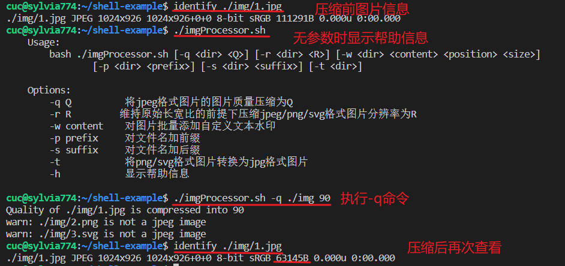

  - 支持对`jpeg/png/svg`格式图片在保持原始宽高比的前提下压缩分辨率

    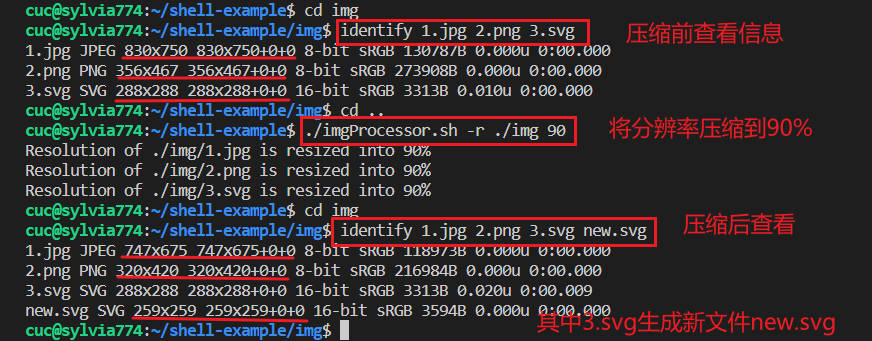

  - 支持对图片批量添加自定义文本水印

    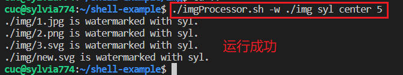

    查看`3.svg`，因为`svg`文件的特殊性很容易辨别出来水印添加成功

    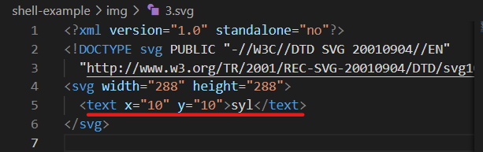

  - 支持批量重命名（统一添加文件名前缀或后缀，不影响原始文件扩展名）

    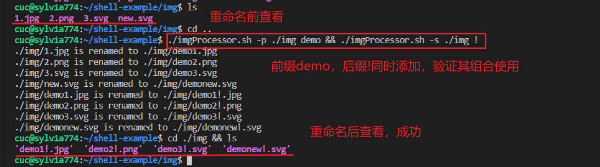

  - 支持将`png/svg`图片统一转换为`jpg`格式图片

    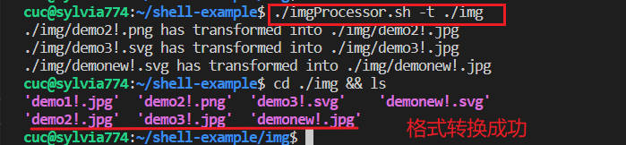

**任务二：用bash编写一个文本批处理脚本，对以下附件分别进行批量处理完成相应的数据统计任务：**

（详细代码见[textBatch-1.sh](./code/textBatch-1.sh)）

- 2014世界杯运动员数据

  - 统计不同年龄区间范围（20岁以下、[20-30]、30岁以上）的球员**数量**、**百分比**

    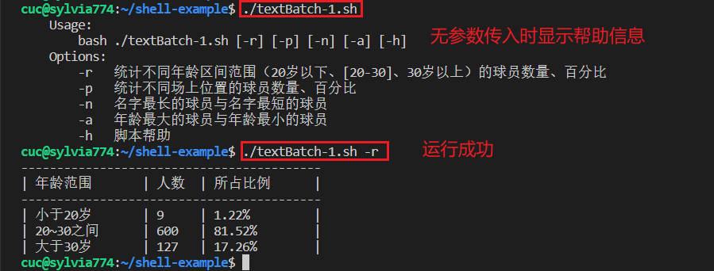

  - 统计不同场上位置的球员**数量**、**百分比**

    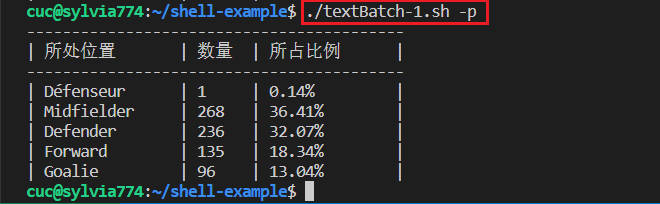

  - 名字最长的球员是谁？名字最短的球员是谁？

    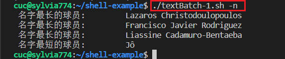

  - 年龄最大的球员是谁？年龄最小的球员是谁？

    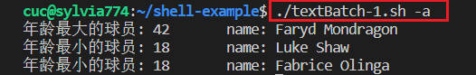

**任务二：用bash编写一个文本批处理脚本，对以下附件分别进行批量处理完成相应的数据统计任务：**

（详细代码见[textBatch-2.sh](./code/textBatch-2.sh)）

（详细数据统计见）

- Web服务器访问日志

  - 统计访问来源主机TOP 100和分别对应出现的总次数

    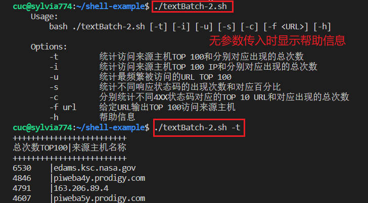

  - 统计访问来源主机TOP 100 IP和分别对应出现的总次数

    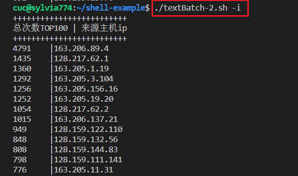

  - 统计最频繁被访问的URL TOP 100

    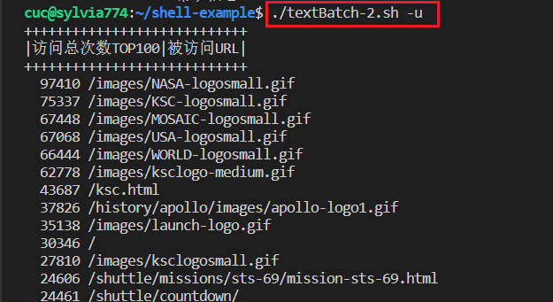

  - 统计不同响应状态码的出现次数和对应百分比

    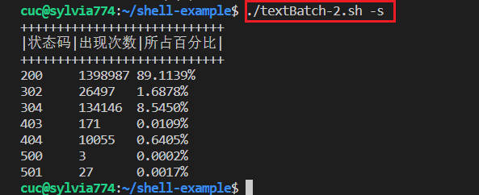

  - 分别统计不同4XX状态码对应的TOP 10 URL和对应出现的总次数

    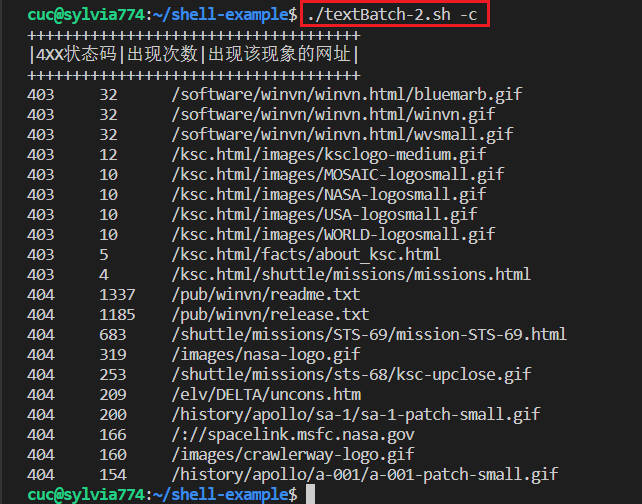

  - 给定URL输出TOP 100访问来源主机

    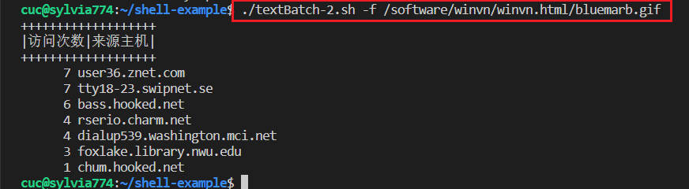

## 实验总结

- `svg`图片无法使用`imagemagick`压缩，使用`rsvg-convert`, 也只能够输出新的`svg`文件不知道应该怎样在原文件上进行修改
- 对于数据统计的表格制作，对齐敲了很久，感觉这种比较精细的功夫需要格式化才行，下次不要再手动敲了
- Travis ci的部署，先想在自己的测试仓库中试一下，发现无法部署，后来才发现要在组织和团体才下能够部署，个人仓库需要进行购买

## 参考链接

